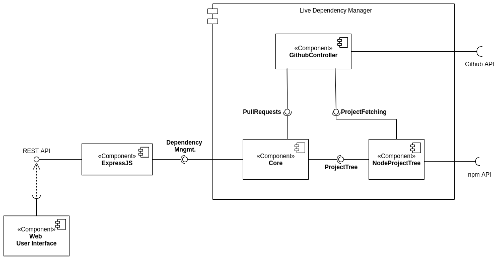
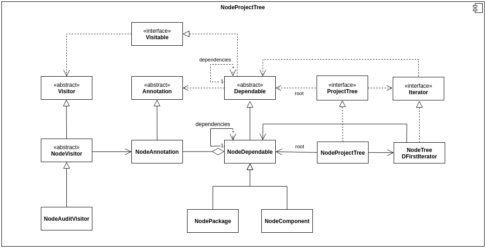

# Live Dependency Management

**2020/2021** - 4rd Year, 2nd Semester

**Course:** *Arquitetura de Sistemas de Software* ([ASSO](https://sigarra.up.pt/feup/en/ucurr_geral.ficha_uc_view?pv_ocorrencia_id=272348)) | Software Architecture

**Authors:** David Silva ([daviddias99](https://github.com/daviddias99)), Gonçalo Marantes ([Marantesss](https://github.com/Marantesss)),João Matos ([joaonmatos](https://github.com/joaonmatos)), Luís Cunha ([luispcunha](https://github.com/luispcunha)), Ricardo Ferreira ([ricardojaferreira](https://github.com/ricardojaferreira))

---


**Description:** In this project we had the task of developping a module of a larger system related with the team of live software development. The goal of the project was not so much the dimension and complexity of the project but rather the process of conceptualizing, creating the architecture, requirements, goals, constraints, instantiating possible design patterns, ...

We ended up creating a tool for visualizing the dependencies of software projects, and analysing the resulting tree. We presented a Proof-of-Concept by instatiating the project for  Javascript projects.

**Technologies:** Typescript, VueJS

**Skills:** Software architecture, design patterns, UML, software design, software documentation

**Grade:** 19/20

---

**Description:** The live dependency management extracts and represents all the dependencies of a project along with other useful annotations and insights.
**Group:** Linda e Girão
**Group Members:** David Silva, Ricardo Ferreira, João Matos, Gonçalo Marantes, Luís Cunha

The aim of this project is to provide a way to explore and refactor the dependency graph of an application or library.

After being given the location (git repository) of a software project, it will produce a visualization of the dependency graph. Ideas for visualization could be using fractals to manage the number of nodes shown at any given time, visualizing the presence of updates, deprecations, and security advisories, and highlighting circular, parallel, or conflicting dependencies.

The live development aspect would be giving the user the option of altering or removing dependencies, showing in real-time the consequences of such actions. After committing to a set of changes, the component would make a commit, issue a patch or make a pull request to apply the intended changes.

This application can make use of the git crawling modules made by other groups. We will use team ST’s git crawlers to analyze the results of the applied dependencies refactoring. The underlying information used on our web-based visualization can integrate with AR/VR components to provide richer visualization capabilities.

---

# 👨‍👨‍👦‍👦 Group members:

- David Silva – [up201705373@fe.up.pt](mailto:up201705373@fe.up.pt)
- Gonçalo Marantes - [up201706917@fe.up.pt](mailto:up201706917@fe.up.pt)
- João N. Matos – up[201705471@fe.up.pt](mailto:201705471@fe.up.pt)
- Luís Cunha – [up201706736@fe.up.pt](mailto:up201706736@fe.up.pt)
- Ricardo Ferreira – [up200305418@fe.up.pt](mailto:up200305418@fe.up.pt)

---

# 🖌️ Design decisions:

### #1 - What language to use?

- Choose a language that both suits a project and that is **compatible with the other projects**. Must be **appliable to different contexts** (to avoid the complexity of having several languages):
    - Dependency analysis module
    - Visualization module

**Decision:** Typescript.

### #2 - How do display the dependency graph?

- Choose a way of displaying the graph that is intuitive and still enables analysis on projects on a large scale.

**Decision:** Display using fractal graphs.

### #3 -  Best suited architecture?

- The overall application architecture must allow for the separation of concerns of different modules, creating a degree of modularity.

**Decision:** The LiveSD project is using a Layered approach.

### #4 - How to internally represent the dependency tree?

- The dependency is potentially a large structure with a lot of caveats that need to be managed.

**Decision:** *Discussed later*

### #5 - How to externally represent the dependency tree?

- The dependency tree needs to be represented in a format that can be used by external tools (JSON, XML, ...).

**Decision:** *Discussed later*

---

# ❌ Issues/Challenges:

- Integration with other groups’ modules (project crawler and AR/VR visualization). We need to choose the scope of our module in a way that both allows for integration with the overall system but also still lets us make a meaningful contribution to the overall project.
- Support for various package/dependency managers (Maven, Composer, Gradle, …)
    - How to analyze dependencies?
    - How to find deprecated packages?
    - How to find security problems?
- What important data should be displayed? And how? (Depends on the technology stack)
    - Fractal graphs
    - Exclusively AR/VR? (Other groups)
    - Color coded edges/nodes
- Local project/repository or remote repository (GitHub, GitLab, …)
    - Should the analyzed project be a standalone project or should it be extracted from a git repository (integration with other group? Possibility for some interesting features like automated pull requests)
- Dependency management suggestions? (Duplicate “import”, ...)
    - How to communicate the deprecated packages, security issues and/or optimizations to the user

    ---

# 🏗️ Architecture



---

# 🎨 Interfaces 🖼️

- **Graphical UI:**
    - **Input:** Remote repository URL through forms
    - **Output:** Interactive graph
- **Data service:**
    - **Input:** Query parameters, HTTP path
    - **Output:** JSON documents

---

# 📄 Requirements

## Functional

- The system should be able to build a model of a project’s dependency graph, based on its location:
    - It must support node.js packages hosted on GitHub,
    - It should model relevant analytics such as if dependencies are outdated or deprecated and whether any security advisories have been issued for the dependencies;
- The system should present ways of visualising the dependency graph and its analytics:
    - The visualisation should not be overwhelming. A balance should always be made between how many dependencies are visible and how deep in the graph those dependencies are,
    - The analytics should be clearly visible in a friendly way, for example by using color coding, ratios/percentages of affected dependencies, etc;
    - The dependency graph could be customized by the user, which could adjust graph depth or cherry pick dependencies;
- The user of the system should be able to perform changes to the project's direct dependencies and get live feedback on the result of them. Such changes and feedback could be:
    - The user could change the version of a dependency,
    - The user could remove a dependency,
    - After such changes, the system could check whether the code still builds (e.g. if using Typescript or other code transformations) or whether unit or integration tests still run,
    - After each change it should recalculate version and CVE analytics, etc, and update the visualisation;
- The system should offer ways of exporting the changes the user chose to do:
    - At least the creation of a Pull Request on the projects GitHub repository must be offered;
- The system should support integration with code hosting providers, including access to private repositories and acting on the user’s behalf:
    - It could support single sign on using such providers,
    - GitHub must be supported;
- The system should offer a data service where by receiving a project location, it would output a document containing a dependency graph and its analytics.

## Non-Functional

- The system should not act destructively. Any changes should be **undoable** and exports should be **transactional**.
- The system should not allow changes to any project without, at least, write access from the user.
- The system’s interface should always provide feedback to the user, even during heavy processes.
    - Allow interaction with other menus/screens.
    - Project analysis should take, at most, 10 seconds to complete for average sized projects.
- The system should not expose analyzed data

---

# 🏆 Architectural goals and constraints 🏅

There are some key requirements and system constraints that have a significant bearing on the architecture. They are:

- (*Extensibility*) Open to extension, to allow easy integration with other dependency managers or source versioning control systems;
- (*Extensibility/Upgradability*) It should be easy to add new ways of analysing the dependency trees;
- (*Fault-tolerance*) If some part of the analysis fails, the whole analysis of the tree shouldn't fail;
- (*Interoperability*) Since we're building this module in the context of a larger system, we mustn't do modules that are already implemented elsewhere;
- (*Interoperability*) Furthermore, information regarding the dependency tree should be implemented in a format that can be used by other modules (particularly, visualization modules)
- (*Performance/Timeliness*) Dependency tree creation and analysis must not take too long. Some trees might be very large so incremental analysis is needed. Concurrent and asynchronous operations could help us achieve this;
- (*Usability*) The system shouldn't stop while analyzing the tree. Asynchronous operations can help with this;

---

# 🔐 Key architectural requirements

A description of the requirements view of the software architecture. It describes the set of scenarios and/or use cases that represent some significant, central functionality. It also describes the set of scenarios and/or use cases that have a substantial architectural coverage (that exercise many architectural elements) or that stress or illustrate a specific, delicate point of the architecture.

## Scenario "Constant Feedback"

A user inserts the URL for the GitHub repository they want to analyze. Although it's a large codebase, they start seeing results immediately instead of waiting for the whole project to be analyzed.

## Scenario "Extend analysis functions"

The developer decides that they want to add the ability for checking circular dependencies in the tree. They need to create a module that receives it and outputs the corresponding tree annotations.

## Scenario "Extend to GitLab"

The developer decides that they would also like to analyze dependencies from a GitLab repository. They should only need to create a new class implementing the methods for fetching repositories and creating merge requests.

## Scenario "Common Tree Language"

In very complex projects, it might be easier to visualize the tree in a 3D environment, e.g. VR. In other projects, a simple fractal graph web-application could suffice. The analyzer should not depend on the type of visualization being made. Rather, a common language for representing the tree and its annotations should be made.

## Scenario "Dependency node error"

I'm analyzing a project that contains a bug in one of it's folders. I expect that the node pertaining to that folder/files is marked with an error, but I still expect the rest of the tree to be shown.

---

# 🗒️ Implementation notes

## Dependency tree representation

### Brainstorming

What follows is a brainstorm about the dependency tree:

- Should the tree incorporate the concepts of directory hierarchy ?
- A file may depend on several other files, or on external modules (`node_modules`).
- For the purpose of representing the tree as a fractal graph, group relations between the files need to be established i.e. the concept of folders.
- That being said, a file may then depend on a file, or on a folder (file dependency not shown).
- The mentioned indirect dependency happens because a file depends on a file inside a folder and the folder has yet to be expanded. However, a file may depend on the `index.js` file inside a folder, which usually means he is importing the package represented by that folder.
- This is similar to importing external modules. When `madge` extracts dependencies, it usually creates the external dependencies as the import of an `index.js` file of a module folder on the  `node_modules` folder.
- Then how do we represent dependencies between files and files, between folders and folders, between files and folders (indirect), between files and folders (`index.js`)
- The dependency graph may have cycles (shouldn't but can).
- How to store and represent annotations done on the tree, should they annotate the nodes or the edges?
- How to represent the graph? Nodes with edge list, or node list + edge list?
- Internal files/packages may have the same name as some node modules

### Tree hierarchy problems

The following, was a first attempt at designing the tree:


First draft at tree hierarchy

However, this solution had the problem of creating such a parallel hierarchy that made it difficult to decide what the classes from the Node hierarchy should extend. For example, if a `NodePackage` class extended the `Package` class, as it should, we would have the problem that the `NodePackage` would "be" a `Dependable` but would not "be" a `NodeDependable`.

Some design patterns could be implemented in this situation such as the use of a Decorator, where the inheritance of the Node classes from the abstract classes would be substituted by composition. 

Another solution was to eliminate the `Package` and `Component` classes altogether. This would eliminate the need for one hierarchy with the justification that these concepts may not be present in every language.

### Final Design

What follows is a UML diagram of the `NodeProjectTree` module:



NodeProjectTree module UML

From the diagram, we can see the different levels of specialization that contribute to the creation of the dependency tree. In fact, the problems described above regarding the parallel hierarchy were solved by making the `Package` and `Component` concepts exclusive to each language (this also helps the design more flexible to several languages). 

Annotations represent information that can be associated with Dependables. For example, one could create annotations for nodes that have security problems or use deprecated modules.

**Inheritance and type-safety**

During development, we had some problems balancing type safety and ensuring that the `Dependable` class implemented common operations like retrieving its dependencies (`getDependencies` method). This happened mainly due to the existence of the self-dependency of the Dependable class.  For example, by defining the method in the `Dependable` class, which returned an internal array of `Dependable` objects, when creating a function to parse the dependency tree for Node we couldn't guarantee that the tree was using `NodeDependable`s; on the other hand, if we defined the `getDependencies` method on the subclasses we couldn't guarantee that future implementations of the tree would have that method.

Our solution was to include the methods `getDependencies` and `getAnnotations` in the upper classes but move their implementation to the child classes, this ensures that the child classes have those methods and that they can overload them to return the correct type of dependencies. A useful side effect is that this allows for different package managers to have different internal ways of representing their dependencies instead of just using an array.

In essence, the need of having dependencies and annotations is guaranteed by the upper classes by having the abstract methods which obligate the child classes to implement them, while also delegating their implementation to those same child classes.

**Visitor pattern**

We utilized the Visitor pattern in order to encapsulate the concept of analyzing the nodes of the dependency tree and producing `Annotation` objects. As a proof-of-concept, we created a `NodeAuditVisitor` whose goal is to analyze the nodes of the tree, in particular the ones that are are npm modules, and add annotations to the ones that have any security problems, using for the effect the `npm audit` tool.

Dependables implement the `Visitable` interface which allows them to accept visitors. `NodeVisitors` have the `visitNodePackage` and `visitNodeComponent` methods which are called by the `NodeDependables` when the `accept` method occurs.

**Iterator pattern**

During development the need to iterate through the tree came up several times: to apply the visitor to every dependable (see Visitor pattern), or to convert the tree to JSON to be used by the visualization tools. Since we are dealing with a tree, iterating through it is not as easy as iterating through an array. By using the Iterator pattern, we were able to abstract this concept into a class that is provided by a `getIterator` method of the `ProjectTree` class.

We created `NodeTreeDFIterator` for iterating the node tree using a depth first approach. Bellow is an example of how the iterator pattern appears in our system:

```tsx
const auditVisitor: NodeAuditVisitor = new NodeAuditVisitor();
const iterator: NodeTreeDepthFirstIterator = tree.getIterator();

await auditVisitor.build(projectPath);
while (!iterator.isDone) {
  iterator.currentItem()!.accept(auditVisitor);
  iterator.next();
}
```

## 🌴 Tree/Graph/Network Visualization Libraries

There are a lot of visualization libraries that make our job a lot easier, so we have decided to use one of them. Below we can find a list of candidates for a network-like graph as well as some examples.

Since we have a lot of information that needs to be shown, it is important that the visualization is highly simplistic. Our main goal was to display dynamic and customizable Network views that allowed for some basic interactions.

After some trials we have decided to use `visjs` and `vue-visjs`, a simple `Vue` wrapper that simplifies `visjs` integration in `Vue` projects. Besides being open-source `Visjs` is incredibly lightweight.

### Vis.js

[Network](https://visjs.github.io/vis-network/docs/network/)

[vue-visjs](https://www.npmjs.com/package/vue-visjs)

[Vis Network](https://visjs.github.io/vis-network/examples/)

### Cytoscape

[Cytoscape.js](https://js.cytoscape.org/)

### D3

[D3.js - Data-Driven Documents](https://d3js.org/)

# Final Result


Box on the left for inputting the git repository. Currently, only projects using Javascript (no Typescript) with NPM work. The repository must have only one javascript project inside i.e. only one `node_modules` folder.

Npm nodes may contain annotations regarding security problems detected by the `npm audit`

 tool. 

Colors represent different categories of tree elements such as directories, files or npm modules. 

A arrow between nodes A and B means that node A depends on node B.
